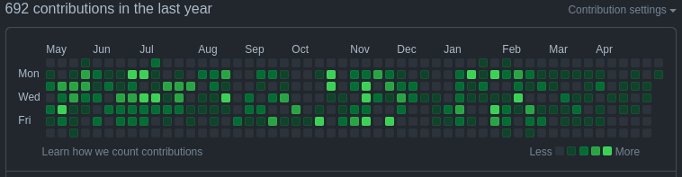

# Denys Kondratenko

## About me

I am someone who proactively solves complex issues (technical, organizational, and leadership), build awesome technical teams, and has a passion for technology.

In the course of my career path, I had the pleasure of hiring and work with very talented engineers and build teams of them to build products and solve issues in a number of technological domains and industries:
  * automation systems
  * industrial machine manufacturers
  * embedded
  * telecoms
  * high-performance computing
  * distributed file system
  * cloud
  * distributed storage
  * monitoring
  * DBaaS

Saying that I still very much like to contribute to technology by writing code and creating solutions so I could better lead the technical team.
So yeah, I am an Engineering Manager with a big emphasis on "Engineering" everything effectively: code, processes, and teams.

As a person, I welcome positive challenges and changes and am not afraid of negative ones. I like sports and tried many different one's over the course of my life, currently enjoying CrossFit, running, swimming, and bouldering. My hobby over my life is traveling and especially hiking.

I am married and have awesome twins :)

Specialties: leadership, engineering, distributed (everything), high performance (anything)
Technologies: HPC, Lustre, Cloud, Ceph, Kubernetes, Storage, Embedded, Kernel
Management: Agile methodologies (Kanban, Scrum, Scaled Agile), TSP/PSP, Holacracy, Empowered Teams.
Languages: Russian native, Ukrainian native, English fluent, German B1.

## Links

  - [LinkedIn](https://www.linkedin.com/in/kondratenko/)
  - [My CV in pdf](./Resume-Denys-Kondratenko.pdf)
  - [GitHub profile](https://github.com/denisok)

## LUG 2013 and IT conf in UA

  - [Legacy code](https://www.slideshare.net/DenisKondratenko/legacy-code-development-and-maintenance)
    - panel discussion during LUG
    - IT conference in Kiev presentation 

## FOSDEM 2018

  - [Ceph & ELK](https://archive.fosdem.org/2018/schedule/event/ceph_and_elk/) talk and [video](https://www.youtube.com/watch?v=iZotyhzY7Kc)

## Open Source Monitoring Conference (OSMC) 2021

  - [pg_stat_monitor](https://www.youtube.com/watch?v=hOURu_1zL_c): A cool extension for better database (PostgreSQL) monitoring

##  Percona - Percona Community Live 2022

  - [PMM on Kubernetes](https://www.youtube.com/watch?v=bqvE_5tcL5M)

## BigData 2023 conference

  - [Fast, Faster, Fastest: Object Storage, Cloud Block Storage, and SSD in Analytic Databases](https://events.pinetool.ai/3079/#sessions/101665?referrer%5Bpathname%5D=%2Fsessions&referrer%5Bsearch%5D=&referrer%5Btitle%5D=Sessions)

## openSUSEConf presentation links

* [oSC19 Rook on Kubic](https://github.com/denisok/oSC19-Rook-on-Kubic/blob/master/slides.md) and [video](https://www.youtube.com/watch?v=f4B3WkEtSEQ)
* [oSC20 openSUSE way presentation](https://denisok.github.io/oSC/oSC20-openSUSEway.html)
* [oSC21 openSUSEway virtual presentation recording](https://www.youtube.com/watch?v=9dOjUs2LA6I)
* [oSC22 openSUSE way presentation](https://denisok.github.io/oSC/oSC22-openSUSEway.html)
* [making a switch from docker to podman in development environment](https://denisok.github.io/oSC/switch_docker_podman_dev_env.html)

## Blog posts

* [PMM development and testing with help of minikube](https://percona.community/blog/2021/12/20/pmm-minikube-postgres/)
* [How to replace `docker` with `podman` for PMM development](https://percona.community/blog/2021/12/27/replace-docker-with-podman-for-pmm-dev/)
* [How and Why Contribute to Communities](https://percona.community/blog/2022/05/30/csi-minikube-multinode/)
* [Binding your application to the database in the Kubernetes cluster](https://percona.community/blog/2023/01/24/k8s-app-db-binding/)
* [Node metrics available inside of a container](https://percona.community/blog/2023/02/06/node-metrics-container/)
* [How to test code blocks in documentation](https://percona.community/blog/2023/02/28/doc-testing/)
